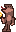

<h1 align="center">Yume Danpu</h1>

  
  
  
  
  

**[Yume Danpu](https://dsnas.itch.io/yume-danpu) is an open-source Yume Nikki fangame created in Brazil by dsans and migel8022.**  
This repository is updated regularly while we're working on it, not just when new versions are released.

&nbsp;

## Development and release videos
We occasionally post videos on YouTube showcasing upcoming or newly released changes and features.  
If you want to see what we're doing next, check out [the playlist](https://www.youtube.com/playlist?list=PL_pzsGsbaRMXNumNYboPS_WFcR2NDsNUd)! I guess it would blow some of the surprises, though...

&nbsp;

  

